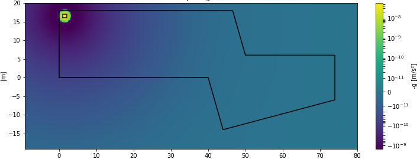
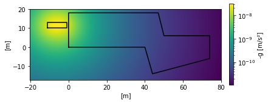

# gravity3D
Small repository for near field gravity computations.
##
What happens when you lower an elevator with 1000kg in it from groundfloor to cellar?

#
What happens when a 20t lorry parks next to the building?

